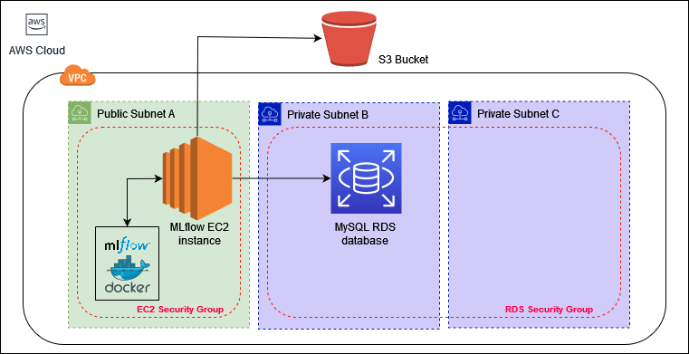

# MLflow AWS deployment (EC2, RDS, S3)
## Overview
This is a proof-of-concept deployment to deploy an MLflow server in AWS using EC2, RDS, and S3.

The project uses Docker to containerize the MLflow application and run it on an EC2 instance.
The Docker image being used is defined in the provided Dockerfile and is uploaded to Dockerhub under `jamesty2114/mlflow`.

The MLflow server uses a MySQL RDS database with two Availability Zones (minimum required) which will store all the metrics, parameters, notes, etc.,
and the S3 bucket to store images, models, etc.

Below is a diagram that shows a summary of the infrastructure.

  

## Prerequisites
You need to have the following installed:
* AWS CLI \([Download](https://docs.aws.amazon.com/cli/latest/userguide/getting-started-install.html)\)
* Terraform \([Download](https://www.terraform.io/downloads)\)

Once AWS CLI is installed, make sure to create an AWS user with programmatic access which Terraform will use to make infrastructure changes in your account.

## Usage
To start the deployment, simply execute the script `init.sh` file.

You will be prompted to input a database username and password.  Simply leaving it as blank will input the default values instead.

If all setup is done properly, Terraform will start building the infrastructure in AWS and deploy the MLflow server.  To visit the MLflow webpage, simply go to the public IP address assigned to the instance.  You can also use the command `terraform output instance_public_ip` to output the IP address.

**Note:** Since this is a proof-of-concept project, it does not contain all the necessary security measures.
